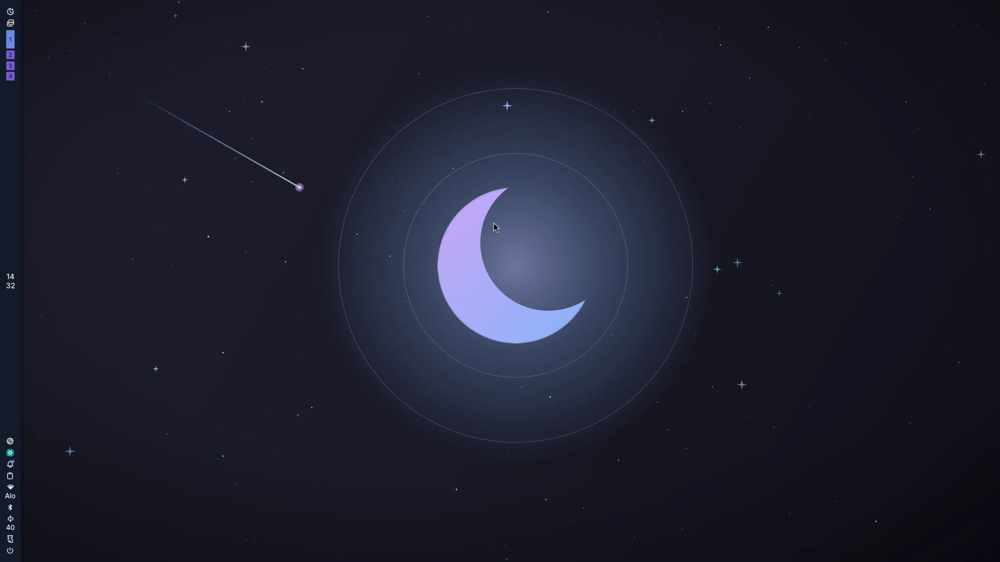

<div align="center">


# noctix-os

**My personal, fully reproducible cross-platform Nix flake — a Hyprland + [Noctalia v5](https://github.com/noctalia-dev/noctalia) NixOS desktop and a nix-darwin Mac, sharing one declarative toolchain.**


<br />



</div>

---

A single flake that builds every machine I use. On NixOS it's a complete, themed Hyprland desktop: the [Noctalia](https://github.com/noctalia-dev/noctalia) shell (bar, launcher, control center, notifications), a GTK4 login greeter, a full dev toolchain, and YubiKey support. On macOS (via nix-darwin) it's the same cross-platform CLI toolchain and dotfiles, minus the Linux-only desktop — all declarative, all reproducible. Tracks `nixos-unstable`.

## Hosts

| Host | Platform | Hardware |
|---|---|---|
| `zenith-pc-ryzen-7` | NixOS · `x86_64-linux` | AMD Ryzen 7 7700X + RTX 2080 |
| `luna-macbook-intel` | macOS (nix-darwin) · `x86_64-darwin` | Intel MacBook |

Every host shares the cross-platform home config in `home/common/`. The NixOS
host layers on `home/linux/` (the full Hyprland + Noctalia desktop and
`modules/`); the Mac layers on `home/darwin.nix` (Homebrew PATH). Only
`hosts/<name>/` differs per machine.

## What's included

### Desktop environment
- **[Hyprland](https://hyprland.org/)** — Wayland compositor, configured via the native **Lua API** (`hl.*`), not the legacy keyword syntax. Dwindle/master/scrolling/monocle layouts, blur, shadows, animations, touchpad gestures.
- **[Noctalia v5](https://github.com/noctalia-dev/noctalia)** shell — bar, app launcher, control center (network/bluetooth/audio/display/calendar/notifications tabs), session menu, lock screen, OSDs. Wallpaper-driven theming.
- **ReGreet** — GTK4 Wayland login greeter running in cage, themed to match.
- **Plymouth** boot splash for a seamless boot → login transition.
- **PipeWire** (ALSA/Pulse/JACK), **Bluetooth** (blueman), **CUPS** printing with mDNS auto-discovery (Avahi), **XDG portals** (Hyprland + GTK), **polkit** agent, GNOME keyring.

### Theming
- Catppuccin Mocha palette (mauve/blue accents), **adw-gtk3-dark** + **Papirus-Dark**, Adwaita cursor.
- Consistent GTK3/GTK4/Qt (qt6ct) dark theming; Noctalia recolors Kitty to match the wallpaper at runtime.
- Fonts: JetBrains Mono Nerd Font, Fira Code, Inter, Noto (incl. CJK + color emoji).

### Applications
- **Terminal:** Kitty (+ foot for the cheatsheet popup) · **Browser:** Firefox · **Files:** Nautilus (+ gvfs, tumbler thumbnails)
- **Media:** VLC, mpv, EOG, Evince, Cheese · **Productivity:** LibreOffice, Thunderbird, GNOME text editor/calculator/calendar
- **Screenshots:** grim + slurp + swappy, OBS Studio · **Clipboard:** cliphist + fuzzel picker
- **System:** pavucontrol, btop, baobab, GNOME system monitor, nm-connection-editor, **1Password** (GUI + polkit integration)

### Dev toolchain (`home/common/dev.nix`)
- **[mise](https://mise.jdx.dev/)** — polyglot runtime/version manager (Node, Python, Go, …) with per-project tools + env
- **[starship](https://starship.rs/)** prompt · **fzf** · **zoxide** · **bat**
- **ripgrep**, **fd**, **jq**, **eza**, **tree**, **lazygit**
- **gh** (GitHub CLI), **git-delta** (syntax-highlighted diffs)
- Nix tooling: **nixd** (LSP), **alejandra** (formatter), **nix-output-monitor**
- Git configured for **SSH commit signing** via your YubiKey FIDO2 key

### Security & hardware
- **YubiKey / FIDO2** baseline — udev rules + `libfido2`, so `sk-ecdsa` SSH keys and SSH commit signing work out of the box.
- AMD + NVIDIA graphics enabled (`hardware.graphics`), 32-bit support for games/Steam.
- Weekly automatic GC, store auto-optimise, Noctalia + Hyprland binary caches.

## Bringing up the NixOS desktop

These are my notes for re-provisioning the desktop from scratch (after a reinstall or on a fresh disk). The config is pinned to the hostname `zenith-pc-ryzen-7` and the username `ni`.

### 1. Install NixOS
Download the [NixOS graphical installer](https://nixos.org/download), flash it, and run through it — setting the hostname to `zenith-pc-ryzen-7` and the username to `ni` so they match this config. The installer writes hardware config to `/etc/nixos/hardware-configuration.nix`.

### 2. Apply this config on first boot
```bash
sudo nixos-rebuild switch --flake github:1-bit-wonder/noctix-os#zenith-pc-ryzen-7 --accept-flake-config
```
- `--accept-flake-config` — trusts the Noctalia and Hyprland binary caches; without it, everything rebuilds from source.

The default password is `nixos` — change it with `passwd ni` after logging in.

> **Reinstalling on different hardware?** The desktop's real `hardware-configuration.nix` is committed to this repo (`hosts/zenith-pc-ryzen-7/`). On new hardware, regenerate it and overwrite the committed copy before deploying:
> ```bash
> git clone https://github.com/1-bit-wonder/noctix-os ~/noctix-os
> cp /etc/nixos/hardware-configuration.nix ~/noctix-os/hosts/zenith-pc-ryzen-7/hardware-configuration.nix
> # then: sudo nixos-rebuild switch --flake ~/noctix-os#zenith-pc-ryzen-7 --accept-flake-config
> ```

### 3. Post-install setup
A few things are intentionally **not** baked into the repo (it's public) and need a one-time setup per machine:

**Git identity** (kept out of the repo on purpose):
```bash
git config --global user.name  "Your Name"
git config --global user.email "you@example.com"
```

**YubiKey SSH key** — both pushing and commit signing use your FIDO2 resident key (`~/.ssh/id_ecdsa_sk_rk`). The key can't live in this public repo and a hardware touch can't be declared, so export it from the YubiKey once per machine (touch + PIN):
```bash
mkdir -p ~/.ssh && chmod 700 ~/.ssh
cd ~/.ssh && ssh-keygen -K     # writes id_ecdsa_sk_rk and id_ecdsa_sk_rk.pub
```
That single step lights up everything else, because it's already wired declaratively:
- **Pushing** — `home/common/ssh.nix` points `github.com` at this key, so `git push` over SSH works with just a touch (no `ssh-agent`, no manual `ssh-add`). If you cloned over HTTPS, switch the remote once: `git remote set-url origin git@github.com:1-bit-wonder/noctix-os.git`.
- **Signing** — `home/common/dev.nix` signs commits with the matching `.pub`. Until the key exists, commits still build but sign as a no-op and show *Unverified* on GitHub.

> Both `home/common/ssh.nix` and `home/common/dev.nix` are in `home/common/`, so this same wiring applies on the Macs — the FIDO2 key flow is identical (export with `ssh-keygen -K`, then push/sign).

Register the key on GitHub **twice** (Settings → SSH and GPG keys → New SSH key): once as an **Authentication key** (to push) and once as a **Signing key** (to verify commits) — GitHub tracks the two roles separately even for the same key.

**Dev runtimes** — none are preinstalled; pull what you need with mise:
```bash
mise use -g node@lts
mise use -g python@latest
```

## Day-to-day workflow
```bash
# NixOS desktop — edit config locally, then apply:
sudo nixos-rebuild switch --flake ~/noctix-os#zenith-pc-ryzen-7

# Sync across machines:
git push
git pull && sudo nixos-rebuild switch --flake ~/noctix-os#zenith-pc-ryzen-7
```

On the Macs the equivalent is `darwin-rebuild switch --flake ~/noctix-os#<host>` (see the macOS section below).

## macOS (nix-darwin)

The Mac runs the same cross-platform toolchain (`home/common/` — fish, starship, helix, git + FIDO2 signing, the CLI staples) wired through [nix-darwin](https://github.com/lnl7/nix-darwin) + home-manager. The Hyprland desktop and `modules/` are NixOS-only and not applied on macOS.

| Host | Chip | `system` |
|---|---|---|
| `luna-macbook-intel` | Intel | `x86_64-darwin` |

> Only the Intel Mac is wired up today. `home/darwin.nix` already detects the Homebrew prefix by architecture, so adding an Apple Silicon Mac later is just a new `hosts/<name>/` + `darwinConfigurations.<name>` entry — see *Adding another host* below.

### Bringing up a Mac

My notes for provisioning the Mac from scratch:

1. **Install Nix** (the [Determinate Systems installer](https://github.com/DeterminateSystems/nix-installer) is the easiest path to a flakes-enabled daemon):
   ```bash
   curl --proto '=https' --tlsv1.2 -sSf -L https://install.determinate.systems/nix | sh -s -- install
   ```

2. **Bootstrap nix-darwin** with this flake:
   ```bash
   sudo nix run nix-darwin -- switch --flake github:1-bit-wonder/noctix-os#luna-macbook-intel --accept-flake-config
   ```
   This installs the `darwin-rebuild` command and applies the config. The login user is `ni` (macOS owns the account; the config only manages its home).

3. **Subsequent rebuilds** use `darwin-rebuild` (NOT `nixos-rebuild`):
   ```bash
   git clone https://github.com/1-bit-wonder/noctix-os ~/noctix-os
   darwin-rebuild switch --flake ~/noctix-os#luna-macbook-intel --accept-flake-config
   ```

4. **Homebrew** (optional, for GUI apps Nix doesn't package well) — install it the [usual way](https://brew.sh); `home/darwin.nix` already puts its prefix on `PATH` (`/usr/local` on Intel, `/opt/homebrew` on Apple Silicon) and exports `HOMEBREW_PREFIX`.

5. **YubiKey SSH key** — same one-time `ssh-keygen -K` export as the NixOS host (see *Post-install setup* above); `home/common/` carries the push + commit-signing wiring to the Mac unchanged.

### Adding another host
- **NixOS:** add `hosts/<name>/` with a `configuration.nix` (set `networking.hostName`) and its generated `hardware-configuration.nix`, plus a `nixosConfigurations.<name>` entry in `flake.nix`.
- **macOS:** add `hosts/<name>/configuration.nix` (set `nixpkgs.hostPlatform`, `networking.hostName`, and the home-manager block importing `[ ../../home/common ../../home/darwin.nix ]`), plus a `darwinConfigurations.<name>` entry in `flake.nix`.

## Keybindings

`Super` = Windows/Meta key. Press `Super + F1` for this cheatsheet on the live system.

| Applications | |
|---|---|
| `Super + Return` | Terminal (Kitty) |
| `Super + E` | Files (Nautilus) |
| `Super + R` | App launcher |
| `Super + Shift + V` | Clipboard history |
| `Super + F1` | Keybind cheatsheet |

| Noctalia panels | |
|---|---|
| `Super + N` | Network panel |
| `Super + B` | Bluetooth panel |
| `Super + A` | Quick settings (control center) |
| `Super + X` | Power / session menu |
| `Super + Delete` | Lock screen |

| Windows | |
|---|---|
| `Super + Q` | Close · `Super + F` fullscreen · `Super + M` maximize |
| `Super + V` | Toggle floating · `Super + C` center · `Super + P` pseudo-tile |
| `Super + Shift + P` | Pin · `Super + T` toggle split · `Alt + Tab` window switcher (all workspaces) |
| `Super + H/J/K/L` | Focus (or arrow keys) |
| `Super + Shift + H/J/K/L` | Move window |
| `Super + Ctrl + H/J/K/L` | Resize window |
| `Super + Left/Right drag` | Move / resize with mouse |

| Workspaces & layouts | |
|---|---|
| `Super + 1–0` | Switch to workspace · `Super + Shift + 1–0` move window |
| `Super + S` / `Super + Shift + S` | Scratchpad toggle / send |
| `Super + Scroll` | Cycle workspaces |
| `Super + Alt + D/M/W/O` | Dwindle / Master / Scrolling / Monocle layout |

| Screenshots & media | |
|---|---|
| `Print` / `Shift + Print` | Region / full screen → annotate (swappy) |
| `Super + Print` | Active window → annotate (swappy) |
| `Ctrl + Print` | Region → clipboard |
| `XF86Audio*` / `XF86MonBrightness*` | Volume / media / brightness (via Noctalia) |
| `Super + Shift + E` | Exit Hyprland session |

## VM & ISO testing

> VM and ISO builds work off-host with no extra flags — the hardware config is committed and the ISO module overrides the filesystems for live media.

```bash
# QEMU VM:
nix build .#vm --accept-flake-config
QEMU_OPTS="-m 4096 -smp 4" ./result/bin/run-zenith-pc-ryzen-7-vm   # login: ni / nixos

# Bootable live ISO:
nix build .#iso --accept-flake-config
sudo dd if=result/iso/noctix-os.iso of=/dev/sdX bs=4M status=progress oflag=sync
```

## Validate changes
Darwin configs evaluate on Linux too (only *building* them needs a Mac), so every host can be checked from anywhere:
```bash
nix flake show --accept-flake-config
nix eval --accept-flake-config .#nixosConfigurations.zenith-pc-ryzen-7.config.system.build.toplevel.drvPath
nix eval --accept-flake-config .#darwinConfigurations.luna-macbook-intel.config.system.build.toplevel.drvPath
```

## Structure
```
flake.nix                         inputs, binary caches, nixos + darwin configs + packages
flake.lock

hosts/zenith-pc-ryzen-7/          Ryzen 7 7700X + RTX 2080 — the NixOS desktop
  configuration.nix               hostname, user, home-manager wiring
  hardware-configuration.nix      real generated config for the live machine (committed)
hosts/luna-macbook-intel/         Intel MacBook — nix-darwin (x86_64-darwin)
  configuration.nix

modules/                          NixOS-only (system layer)
  system.nix                      bootloader, nix settings, locale, networking, YubiKey
  desktop.nix                     Hyprland, greetd/regreet, PipeWire, Bluetooth, portals
  packages.nix                    system packages + keybind cheatsheet
  peripherals.nix                 Logitech (logiops/Solaar) peripheral tweaks

home/                             split by platform — location encodes the layer
  default.nix                     NixOS entrypoint (imports ./common + ./linux)
  darwin.nix                      macOS layer (Homebrew PATH, mac env)
  common/                         cross-platform — imported by EVERY host
    default.nix                   auto-imports the folder + shared option settings
    fish.nix  starship.nix  helix.nix  fastfetch.nix
    dev.nix                       dev toolchain — mise, git signing, CLI tools
    ssh.nix                       SSH client config (FIDO2 key for GitHub push)
    starship.toml                 starship theme (sourced by dev.nix)
  linux/                          Linux-only desktop — NixOS hosts only
    default.nix                   auto-imports the folder + Noctalia module + Wayland env
    hyprland.nix                  Hyprland config (native Lua API via hl.*)
    noctalia.nix                  Noctalia shell settings + wallpapers
    theme.nix                     GTK/Qt/cursor theming
    screenshots.nix               grim/slurp/swappy bindings
    services.nix                  user services (hypridle)
    kitty.nix  firefox.nix

assets/                           wallpaper images, logo
```

> `home/common/default.nix` and `home/linux/default.nix` each auto-import every other `*.nix` in their folder, so adding a tool is just dropping a file in the right layer — no import list to edit. Non-`.nix` files (e.g. `starship.toml`) are skipped.

## Flake outputs

| Output | Description |
|---|---|
| `nixosConfigurations.zenith-pc-ryzen-7` | The live NixOS desktop |
| `nixosConfigurations.zenith-pc-ryzen-7-iso` | Bootable live ISO |
| `darwinConfigurations.luna-macbook-intel` | Intel MacBook (nix-darwin) |
| `packages.x86_64-linux.vm` | QEMU VM for quick testing |
| `packages.x86_64-linux.iso` | ISO image (`result/iso/noctix-os.iso`) |
